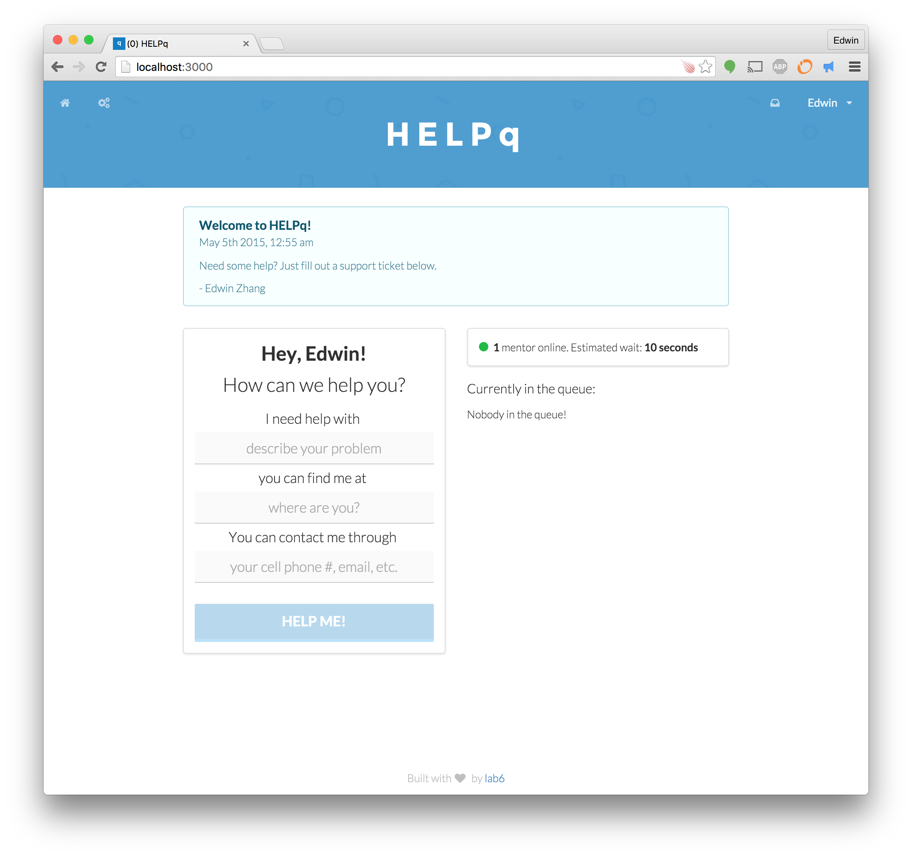
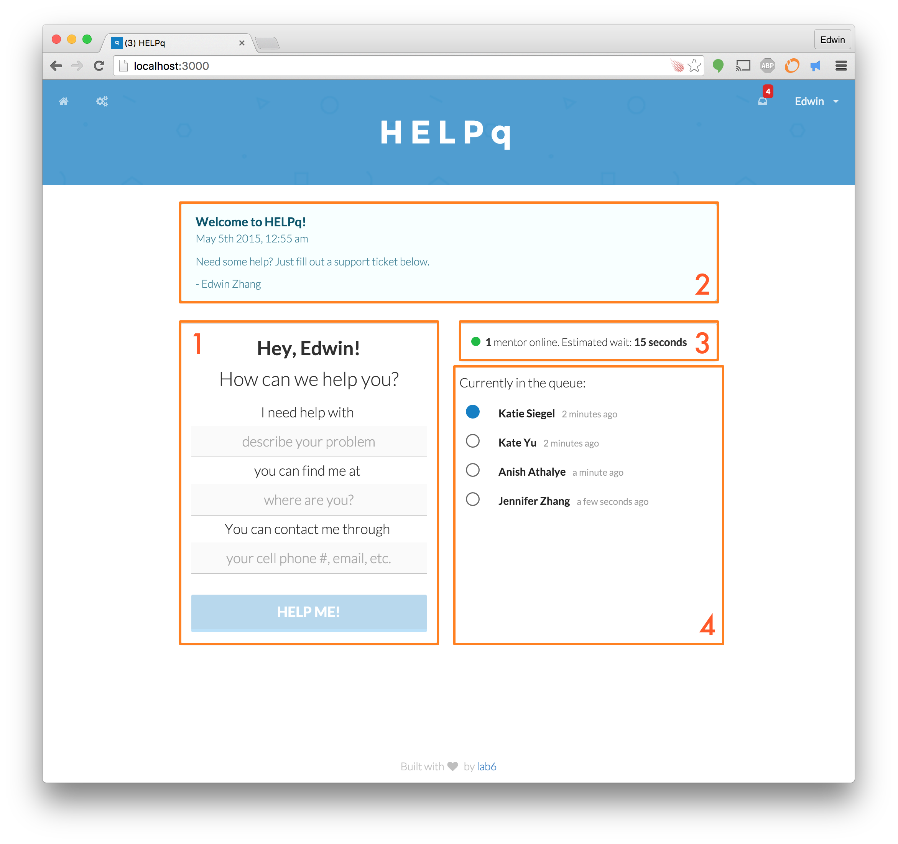
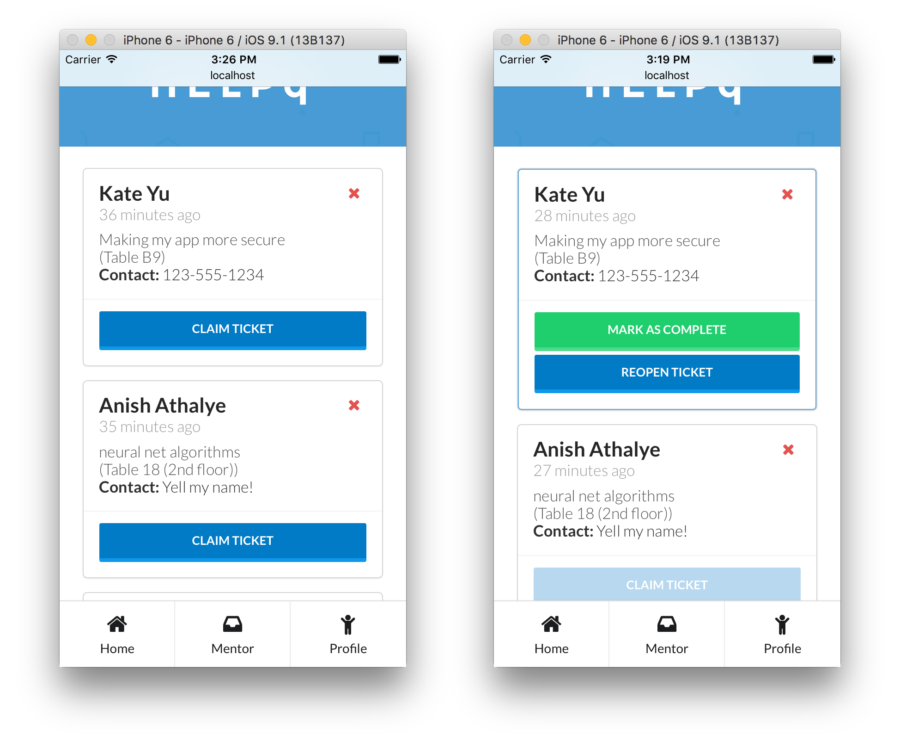
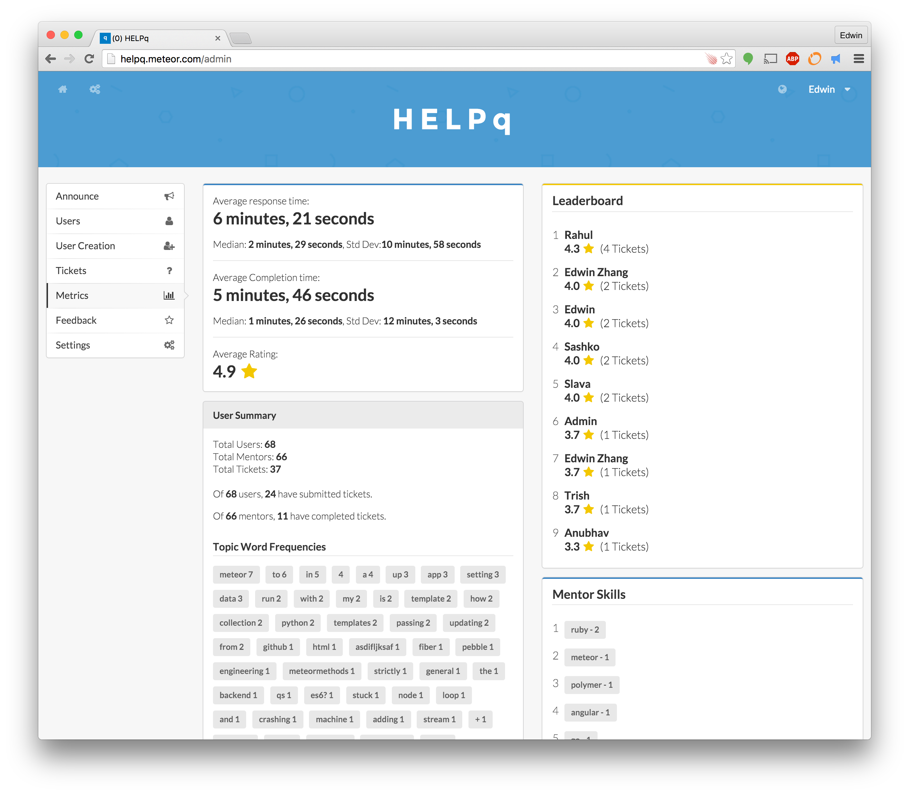

HELPq
======

An extensible, customizable real-time queue system, built with [Meteor](https://www.meteor.com/)!



What is this?
------------

HELPq was originally built for [HackMIT](https://hackmit.org), but has been used at hackathons like [Blueprint](http://blueprint.hackmit.org), [Meteor Summer Hackathon 2015](http://meteorhack.meteor.com/), [WHACK](http://wellesleyhacks.org/), [MakeMIT](http://makemit.org/) and [WildHacks](http://wildhacks.org/) (among others!).

It is a real-time help queue and mentor management application, targeted at hackathons and classrooms, where there is a need for issues to be claimed and satisfied within minutes. It includes a simple interface for requesting tickets, claiming tickets, administrating users/mentors, and examining metrics.


It is built with an emphasis on three fundamental user experiences:

### Keep it simple

Students should be able to log in and do exactly what they want - submit a ticket. Nothing more complicated than that.

### Pull, don't Push

Mentors should not receive any type of push notifications when tickets are requested. Instead, mentors should be pulling from the mentor view and claiming tickets whenever they see them. That way, mentors will not get annoyed by a feed of requests and instead provide high-quality advice because they are themselves actively seeking out people to help.

### Encourage in-person interaction

Mentors can claim tickets, complete tickets, or choose to reopen them. Mentors can only claim a single ticket at any given time. There is no ability to message a student through the app in order to encourage a mentor to find that student and help them in person. A student can, however, choose to include other contact information in case contact is needed to clarify location.

Features
---------

### Home



#### 1 - Ticket Request

Users can request a ticket, by providing their problem description, where they are, and how they can best be contacted. This copy can be easily modified in one of the config files!

Once submitted, users have an option to cancel their ticket ("Nevermind!"). Tickets will also expire based on a value determined by the admin.

#### 2 - Announcements

Admin can send out announcements with varying colors through the admin dashboard, which appear on on the home screen.

#### 3 - Mentor Status

The mentor status bar shows how many mentors are currently online, and calculates the expected wait time based on historical ticket claim and completion times.

#### 4 - Current Queue

The current queue shows who is currently in the queue and which people are currently receiving help. Because the nature of questions available mentors can address are highly variable, tickets will often not be answered in order of submission.

### Mentor



Mentors should be mobile, and the HELPq is designed for mentors to browse the help tickets on their smart phones.

If a user is a mentor, they will have an inbox icon in the top right they can click to navigate to the mentor view. If the HELPq is being viewed on mobile or a very narrow window, the app is responsive and will pull up a navigation bar on the bottom for Home, Mentor, and Profile.


#### Claim

You can claim a ticket by selecting "Claim Ticket". This will notify the user that you are on your way! Once a ticket is claimed, you cannot claim another ticket unless you complete or reopen the ticket.

#### Complete

Once you are done working with a student, you should mark that ticket as completed. This will give the student an opportunity to rate their experience with you!

#### Reopen

You can choose to reopen the ticket if you feel like you could not adequately solve the problem, or think someone would be better at addressing it.

### Admin



The admin dashboard has a lot of useful features for hackathon organizers or class staff! Shown above is the Metrics dashboard.

#### Announce

The announcement section allows you to create announcements for the home screen, with a variety of different colors.

#### Users

The users table lets you see all of the current users, and mark them as mentors or admins. You can also edit other user's information - of course, be responsible with this power!

#### User Creation

Login is done through Github or Facebook (which can be enabled or disabled in a config file), but you can manually create user accounts.

This takes a CSV formatted string, which will then check your format, and create users asynchronously. If a user's account creation fails, the result will be shown.

This feature was designed for use in classroom settings, or other restricted access settings, so that you can create an account for each student and a password unique to them.

This feature is also useful for when a user does not want to login with Facebook or GitHub (even though only public information is retrieved).

#### Tickets

The tickets table will show you a history of all tickets.

- Green: tickets have been completed
- Red: tickets that have been cancelled
- Yellow: tickets that have expired
- Grey: tickets that are currently claimed

#### Metrics

The metrics pane shows a lot of information regarding the usage of the queue.

The first is a metrics summary, which includes average, median, and std dev of response time and completion time, as well as the raw average of all ticket ratings.

The leaderboard also shows the top 10 mentors with ratings. Their rating is not a raw average of their tickets, but instead blurred slightly with weighting. This is to avoid the situation where a user with a single 5 star rating would be listed above another user with four 5 star ratings and a single 4 star rating.

#### Feedback

The feedback section is a feed of all mentor feedback, with star rating and a note. Bad ratings are highlighted.

#### Settings

Settings allows you to adjust various settings in the queue. Right now, you can open/close the queue and set the time for when tickets expire.


Usage Data
----------

We've used this at a bunch of hackathons and we have some data on them :)

| Hackathon | Date | Response time average | median | stddev | Completion Time average | median | stddev | Rating Average | Users | Mentors | Tickets|
|-----------|------|-------------------|--------|---------|---------------------|--------|---------|------------|-------|---------|--------|
|**Blueprint High School Hackathon 2015** | 2/22/2015 | 5:11 | 1:26 | 9:54 | 10:37 | 6:29 | 13:23 | 4.9 | 193 | 64 | 170 |
|**Meteor Summer Hackathon 2015** | 8/8/2015 | 6:21 | 2:29 | 10:58 | 5:46 | 1:26 | 12:03 | 4.09 | 68 | 66| 37 |
|**HackMIT 2015** | 9/19/2015 | 9:37 | 2:48 | 28:00 | 16:30 | 10:01 | 22:59 | 4.7 | 425 | 242 | 502 |
|**WHACK 2015** | 10/3/2015 | 7:55 | 4:56 | 12:30 | 18:19 | 13:02 | 17:27 | 4.9 | 87 | 39 | 94 |
|**HackIllinois**| 2/19/2016 | 56:00 | 8:47 | 3:00:29 | 32:53 | 18:46 |  1:00:25 | 4.6 | 353 | 353 | 221 |

Bring HELPq to your hackathon/classroom!
========================================

Requirements
------------

Make sure that you have `meteor` installed.
You can install Meteor through their [website.](https://www.meteor.com/)


Quickstart
----------

#### Mac OS X, Linux

```sh
  ./create_config
  meteor
```

#### Windows:

Copy the `private/config.json.template` into `private/config.json`

```sh
  meteor
```

Deploy
------
**IMPORTANT**

Without login configuration, you will only be able to login with the admin username and password specified in `private/config.json`.

To change the password of the admin account after deployed, you must manually remove the admin user through the meteor mongo shell, and then redeploy with a new admin username/password value. *This will be changed pretty soon*

Deploy with:

```sh
  meteor deploy <your domain name>.meteor.com
```

Configuration
-------------

#### Login

To configure login, edit `private/config.json`

In `private/config.json`, provide the appropriate application id/secret combinations
for either Facebook or Github authentication, or choose to disable them.

#### Branding

For front end branding, edit `client/stylesheets/scss/_branding.scss`

In this file, you will find brand variables and classes for the main splash and main banner.

You can edit these and observe the changes. There are also comments to explain what each setion does.

#### Copy

To edit copy, edit `lib/constants.js`.

In this file, you will find a place where you can change various strings across the site, including the title of your app.

Orientation
-----------

The queue has been found to be most effective with an orientation with mentors and a tight integration with the way a hackathon/classroom manages mentorship. If you'd like to talk about how this could work for your hackathon/classroom, don't hesitate to email me at [ehzhang@mit.edu](mailto:ehzhang@mit.edu)!

Feedback
--------

Have you used HELPq or are planning to use it at your hackathon? I'd love to hear how effective it was, what kinds of metrics you got, and what kinds of things people wanted. Don't hesitate to email me at [ehzhang@mit.edu](mailto:ehzhang@mit.edu)!

Contributing
------------

I'd love to take pull requests! Please read the [Contributing Guide](CONTRIBUTING.md) first!
